# Deft

**One-shot, anti-slop**

*A layered framework for AI-assisted development with consistent standards and workflows.*

## TL;DR

Deft is a SKILL.md that makes AI coding significantly more effective by providing consistent, hierarchical standards. Instead of repeating the same instructions in every AI session, you define your preferences once—from general coding style to project-specific rules—and AI agents follow them. The result: higher quality code, reproducible workflows, and AI that gets better over time by learning from your patterns.

**Key benefits:** No more "AI forgot my preferences", no more inconsistent code style across AI sessions, no more re-explaining your stack every time.

**Don't have preferences yet?** No problem—Deft ships with professional-grade defaults for Python, Go, TypeScript, C++, and common workflows. Use it out of the box and customize later.

**Platform compatibility:** If you're on a platform that doesn't yet support SKILL.md (such as Warp.dev), just add a line to your `AGENTS.md` that says "See deft/main.md".

**Context-efficient:** Deft keeps AI context windows lean through RFC 2119-based notation (!, ~, ≉, ⊗) and lazy-loading—AI only reads the files relevant to the current task, not everything at once.

## 🎸 From Vibe to Virtuoso

**AGENTS.md** is great for vibe-coding—loose guidance, good enough for quick work:

> "Make it clean, I like tests, use TypeScript."

**Deft** is for when you want virtuoso results: precise standards, reproducible workflows, and AI that improves over time.

| Vibe (AGENTS.md) | Virtuoso (Deft) |
|------------------|-----------------|
| All rules in one file | Modular—load only what's relevant |
| Gets bloated across languages/tools | Scales cleanly (python.md stays focused) |
| Same context loaded every session | Lazy-loading saves tokens |
| Preferences mixed with standards | Clear separation (user.md vs language files) |
| No evolution mechanism | Meta files capture learnings automatically |
| Starts fresh each project | Portable across projects |

**When to use which:**
- Your AGENTS.md is under 200 lines and you work in one language? Vibe is fine.
- It's growing unwieldy, you're repeating yourself, or you want consistent quality across projects? Deft pays off.

Same instrument, different mastery.

## 🎯 What is Deft?

Deft is a structured approach to working with AI coding assistants that provides:

- **Consistent coding standards** across languages and projects
- **Reproducible workflows** via task-based automation
- **Self-improving guidelines** that evolve with your team
- **Hierarchical rule precedence** from general to project-specific
- **Lazy loading** - only read files relevant to current task (see [REFERENCES.md](./REFERENCES.md))

## 📝 Notation Legend

Deft uses compact notation for requirements:

- **!** = MUST (required, mandatory)
- **~** = SHOULD (recommended, strong preference)
- **≉** = SHOULD NOT (discouraged, avoid unless justified)
- **⊗** = MUST NOT (forbidden, never do this)

This notation appears in technical standard files (python.md, go.md, etc.) for scanability. Based on RFC 2119.

## 📚 The Layers

Deft uses a layered architecture where more specific rules override general ones:

```mermaid
flowchart TB
    subgraph precedence ["Rule Precedence (top = highest)"]
        U["👤 user.md<br/><i>Personal preferences</i>"]
        P["📁 project.md<br/><i>Project-specific rules</i>"]
        L["🐍 python.md / go.md / etc.<br/><i>Language standards</i>"]
        T["🔧 taskfile.md<br/><i>Tool guidelines</i>"]
        M["🤖 main.md<br/><i>General AI behavior</i>"]
        S["📋 specification.md<br/><i>Project requirements</i>"]
    end

    U --> P --> L --> T --> M --> S

    style U fill:#4ade80,stroke:#166534,color:#000
    style P fill:#60a5fa,stroke:#1e40af,color:#000
    style L fill:#facc15,stroke:#a16207,color:#000
    style T fill:#fb923c,stroke:#c2410c,color:#000
    style M fill:#c084fc,stroke:#7c3aed,color:#000
    style S fill:#94a3b8,stroke:#475569,color:#000
```



### 📁 Directory Structure

```
deft/
├── README.md              # This file
├── main.md                # Entry point - general AI guidelines
│
├── core/                  # Core framework files
│   ├── project.md         # Project template
│   ├── user.md            # User preferences (highest precedence)
│   └── ralph.md           # Ralph loop concept (draft)
│
├── coding/                # Coding standards
│   ├── coding.md          # General coding guidelines
│   └── testing.md         # Testing standards
│
├── languages/             # Language-specific standards
│   ├── cpp.md
│   ├── go.md
│   ├── python.md
│   └── typescript.md
│
├── interfaces/            # Interface types
│   ├── cli.md             # Command-line interfaces
│   ├── rest.md            # REST APIs
│   ├── tui.md             # Terminal UIs
│   └── web.md             # Web UIs
│
├── tools/                 # Tooling and workflow
│   ├── git.md             # Git conventions
│   ├── github.md          # GitHub workflows
│   ├── taskfile.md        # Task automation
│   └── telemetry.md       # Observability
│
├── swarm/                 # Multi-agent coordination
│   └── swarm.md           # Swarm guidelines
│
├── templates/             # Templates and examples
│   ├── make-spec.md       # Spec generation guide
│   ├── make-spec-example.md
│   └── specification.md   # Project spec template
│
└── meta/                  # Meta/process files
    ├── code-field.md      # Coding mindset
    ├── ideas.md           # Future directions
    ├── lessons.md         # Learnings
    └── suggestions.md     # Improvements
```

### 🔧 Core Files
**main.md** - Entry point, general AI guidelines  
**coding/coding.md** - Software development standards  
**coding/testing.md** - Testing standards  
**core/project.md** - Project-specific template  
**core/user.md** - Your personal preferences (highest precedence)

### 🐍 Languages
**languages/python.md** - Python standards (≥85% coverage, mypy strict, ruff/black)  
**languages/go.md** - Go standards (≥85% coverage, Testify)  
**languages/typescript.md** - TypeScript standards (strict mode, Vitest)  
**languages/cpp.md** - C++ standards (C++20/23, Catch2/GoogleTest)

### 💻 Interfaces
**interfaces/cli.md** - Command-line interface patterns  
**interfaces/rest.md** - REST API design  
**interfaces/tui.md** - Terminal UI (Textual, ink)  
**interfaces/web.md** - Web UI (React, Tailwind)

### 🛠️ Tools
**tools/taskfile.md** - Task automation best practices  
**scm/git.md** - Commit conventions, safety  
**scm/github.md** - GitHub workflows  
**tools/telemetry.md** - Logging, tracing, metrics

### 🐝 Swarm
**swarm/swarm.md** - Multi-agent coordination patterns

### 📝 Templates
**templates/make-spec.md** - Specification generation  
**templates/specification.md** - Project spec template

### 🧠 Meta
**meta/code-field.md** - Coding mindset and philosophy  
**meta/lessons.md** - Codified learnings (AI-updatable)  
**meta/ideas.md** - Future directions  
**meta/suggestions.md** - Improvement suggestions

## 🚀 Getting Started

**Quick start (one-liner):**

```bash
git clone https://github.com/visionik/deft && deft/run bootstrap
```

### 1. Install Deft

Create a directory for a new project or `cd` into an existing one:

```bash
mkdir my-project && cd my-project  # New project
# OR
cd ~/Projects/existing-project      # Existing project

git clone https://github.com/visionik/deft  # Installs deft in ./deft/ subdir
```

### 2. Bootstrap Your Configuration

Use `deft/run bootstrap` to create your user and project preferences:

```bash
deft/run bootstrap       # Interactive setup for user.md and project.md
```

Or use individual commands:

```bash
deft/run bootstrap       # Creates user.md with your preferences
deft/run project         # Creates project.md with tech stack, standards
```

### 3. Generate Specification

`deft/run bootstrap` will guide you through creating a `SPECIFICATION.md`, or create one anytime:

```bash
deft/run spec            # AI-assisted specification interview
```

Other commands:

```bash
deft/run reset           # Reset config files
deft/run validate        # Check deft configuration
deft/run doctor          # Check system dependencies
```

### 4. Build With AI

Ask your AI to build the product/project from `SPECIFICATION.md` and away you go:

```
Read SPECIFICATION.md and implement the project following deft/main.md standards.
```

### Rule Hierarchy

Rules cascade with precedence:

1. **user.md** (highest) - your personal overrides
2. **project.md** - project-specific rules
3. **Language files** (python.md, go.md) - language standards
4. **Tool files** (taskfile.md) - tool guidelines
5. **main.md** - general AI behavior
6. **specification.md** (lowest) - requirements

### Continuous Improvement

The deft process evolves over time:

```mermaid
flowchart TD
    subgraph evolution ["Continuous Evolution"]
        DEV["🛠️ Development<br/><i>Daily coding</i>"]
        LEARN["📚 lessons.md<br/><i>Patterns discovered</i>"]
        IDEAS["💡 ideas.md<br/><i>Future directions</i>"]
        SUGGEST["📝 suggestions.md<br/><i>Improvements</i>"]
        USER["👤 user.md<br/><i>Preferences</i>"]
        STANDARDS["📖 Language/Tool files<br/><i>Evolving standards</i>"]
    end

    DEV -->|"AI discovers"| LEARN
    DEV -->|"AI notes"| IDEAS
    DEV -->|"AI suggests"| SUGGEST
    LEARN -->|"Promote"| STANDARDS
    IDEAS -->|"Review"| STANDARDS
    SUGGEST -->|"Accept"| USER
    STANDARDS -->|"Inform"| DEV
    USER -->|"Guide"| DEV

    style DEV fill:#f0abfc,stroke:#a855f7,color:#000
    style LEARN fill:#fde68a,stroke:#d97706,color:#000
    style IDEAS fill:#a5f3fc,stroke:#06b6d4,color:#000
    style SUGGEST fill:#fecaca,stroke:#ef4444,color:#000
    style USER fill:#86efac,stroke:#22c55e,color:#000
    style STANDARDS fill:#c7d2fe,stroke:#6366f1,color:#000
```



- AI updates `lessons.md` when learning better patterns
- AI notes ideas in `ideas.md` for future consideration
- AI suggests improvements in `suggestions.md`
- You update `user.md` with new preferences
- You update language/tool files as standards evolve

## 💡 Key Principles

### Task-Centric Workflow with Taskfile

**Why Taskfile?**

Deft uses [Taskfile](https://taskfile.dev) as the universal task runner for several reasons:

1. **Makefiles are outdated**: Make syntax is arcane, portability is poor, and tabs vs spaces causes constant friction
2. **Polyglot simplicity**: When working across Python (make/invoke/poetry scripts), Go (make/mage), Node (npm scripts/gulp), etc., each ecosystem has different conventions. Taskfile provides one consistent interface
3. **Better than script sprawl**: A `/scripts` directory with dozens of bash files becomes chaotic—hard to discover, hard to document, hard to compose. Taskfile provides discoverability (`task --list`), documentation (`desc`), and composition (`deps`)
4. **Modern features**: Built-in file watching, incremental builds via checksums, proper error handling, variable templating, and cross-platform support

**Usage:**

```bash
task --list        # See available tasks
task check         # Pre-commit checks
task test:coverage # Run coverage
task dev           # Start dev environment
```

### Test-Driven Development (TDD)

Deft embraces TDD as the default development approach:

```mermaid
flowchart LR
    subgraph cycle ["TDD Cycle"]
        R["🔴 RED<br/>Write failing test"]
        G["🟢 GREEN<br/>Make it pass"]
        B["🔵 REFACTOR<br/>Improve code"]
    end

    R -->|"Minimal code"| G
    G -->|"Clean up"| B
    B -->|"Next feature"| R

    style R fill:#fca5a5,stroke:#dc2626,color:#000
    style G fill:#86efac,stroke:#16a34a,color:#000
    style B fill:#93c5fd,stroke:#2563eb,color:#000
```



1. **Write the test first**: Define expected behavior before implementation
2. **Watch it fail**: Confirm the test fails for the right reason
3. **Implement**: Write minimal code to make the test pass
4. **Refactor**: Improve code quality while keeping tests green
5. **Repeat**: Build features incrementally with confidence

**Benefits:**

- Tests become specifications of behavior
- Better API design (you use the API before implementing it)
- High coverage naturally (≥85% is easy when tests come first)
- Refactoring confidence
- Living documentation

**In Practice:**

```bash
task test          # Run tests in watch mode during development
task test:coverage # Verify ≥75% coverage
task check         # Pre-commit: all quality checks including tests
```

### Quality First

- ≥85% test coverage (overall + per-module)
- Always run `task check` before commits
- Run linting, formatting, type checking
- Never claim checks passed without running them

### Spec-Driven Development (SDD)

Before writing any code, deft uses an AI-assisted specification process:

```mermaid
flowchart LR
    subgraph sdd ["Spec-Driven Development"]
        I["💡 Idea<br/><i>Initial concept</i>"]
        Q["❓ Interview<br/><i>AI asks questions</i>"]
        S["📋 SPECIFICATION.md<br/><i>Complete plan</i>"]
        D["👥 Development<br/><i>Parallel agents</i>"]
    end

    I -->|"make-spec.md"| Q
    Q -->|"Clarify ambiguity"| S
    S -->|"Independent tasks"| D

    style I fill:#fef08a,stroke:#ca8a04,color:#000
    style Q fill:#c4b5fd,stroke:#7c3aed,color:#000
    style S fill:#6ee7b7,stroke:#059669,color:#000
    style D fill:#7dd3fc,stroke:#0284c7,color:#000
```



**The Process:**

1. **Start with make-spec.md**: A prompt template for creating specifications

   ```markdown
   I want to build **\_\_\_\_** that has the following features:

   1. Feature A
   2. Feature B
   3. Feature C
   ```

2. **AI Interview**: The AI (Claude or similar) asks focused, non-trivial questions to clarify:
   - Missing decisions and edge cases
   - Implementation details and architecture
   - UX considerations and constraints
   - Dependencies and tradeoffs

   Each question includes numbered options and an "other" choice for custom responses.

3. **Generate SPECIFICATION.md**: Once ambiguity is minimized, the AI produces a comprehensive spec with:
   - Clear phases, subphases, and tasks
   - Dependency mappings (what blocks what)
   - Parallel work opportunities
   - No code—just the complete plan

4. **Multi-Agent Development**: The spec enables multiple AI coding agents to work in parallel on independent tasks

**Why SDD?**

- **Clarity before coding**: Catch design issues early
- **Parallelization**: Clear dependencies enable concurrent work
- **Scope management**: Complete spec prevents scope creep
- **Onboarding**: New contributors/agents understand the full picture
- **AI-friendly**: Structured specs help AI agents stay aligned

**Example**: See `templates/make-spec.md` for the interview process template

### Convention Over Configuration

- Use Conventional Commits for all commits
- Use hyphens in filenames, not underscores
- Keep secrets in `secrets/` directory
- Keep docs in `docs/`, not project root

### Safety and Reversibility

- Never force-push without permission
- Assume production impact unless stated
- Prefer small, reversible changes
- Call out risks explicitly

## 📖 Example Workflows

```mermaid
flowchart TB
    subgraph NewProject ["🆕 New Python Project"]
        direction TB
        NP1["AI reads main.md"] --> NP2["AI reads python.md"]
        NP2 --> NP3["AI reads taskfile.md"]
        NP3 --> NP4["Setup: pytest, ruff, black, mypy"]
        NP4 --> NP5["Configure: ≥85% coverage"]
        NP5 --> NP6["You customize: project.md"]
    end
    
    subgraph ExistingGo ["📂 Existing Go Project"]
        direction TB
        EG1["AI reads user.md"] --> EG2["AI reads project.md"]
        EG2 --> EG3["AI reads go.md"]
        EG3 --> EG4["AI runs task check"]
        EG4 --> EG5["AI makes changes"]
    end
    
    subgraph Review ["🔍 Code Review"]
        direction TB
        CR1["AI reads quality standards"] --> CR2["task quality"]
        CR2 --> CR3["task test:coverage"]
        CR3 --> CR4["Check commits"]
        CR4 --> CR5["Update suggestions.md"]
    end
```



### Starting a New Python Project


1. AI reads: `main.md` → `python.md` → `taskfile.md`
2. AI sets up: pytest, ruff, black, mypy, Taskfile
3. AI configures: ≥85% coverage, PEP standards
4. You customize: `project.md` with project specifics

### Working on an Existing Go Project


1. AI reads: `user.md` → `project.md` → `go.md` → `main.md`
2. AI follows: go.dev/doc/comment, Testify patterns
3. AI runs: `task check` before suggesting changes
4. AI respects: your user.md overrides

### Code Review Session


1. AI references quality standards from language file
2. AI runs `task quality` and `task test:coverage`
3. AI checks Conventional Commits compliance
4. AI suggests improvements → adds to `suggestions.md`

## 📝 Contributing to Deft

As you use deft, AI maintains three meta files that help the framework evolve:

### lessons.md — Patterns discovered during development

```markdown
## 2026-01-15: Testify suite setup
When using Testify in Go, always define `suite.Suite` struct with 
dependencies as fields, not package-level vars. Discovered during 
auth-service refactor—package vars caused test pollution.

## 2026-01-20: CLI flag defaults
For CLI tools, default to human-readable output, use `--json` flag 
for machine output. Users expect pretty by default.
```

### ideas.md — Potential improvements for later

```markdown
- [ ] Add `deft/run upgrade` command to pull latest deft without 
      losing local user.md/project.md customizations
- [ ] Consider `deft/interfaces/grpc.md` for protobuf/gRPC patterns
- [ ] Explore integration with cursor rules format
```

### suggestions.md — Project-specific improvements

```markdown
## auth-service
- The retry logic in `client.go` should use exponential backoff 
  (currently linear)—see coding.md resilience patterns

## api-gateway  
- Consider splitting routes.go (850 lines) into domain-specific 
  route files per coding.md file size guidelines
```

Review these periodically and promote good ideas to main guidelines

## 🎓 Philosophy

Deft embodies:

- **Correctness over convenience**: Optimize for long-term quality
- **Standards over flexibility**: Consistent patterns across projects
- **Evolution over perfection**: Continuously improve through learning
- **Clarity over cleverness**: Direct, explicit, maintainable code

---

**Next Steps**: Read [main.md](./main.md) for comprehensive AI guidelines, then customize [user.md](./user.md) with your preferences.

---

Copyright © 2025-2026 Jonathan "visionik" Taylor — https://deft.md  
Licensed under the [MIT License](./LICENSE.md)
